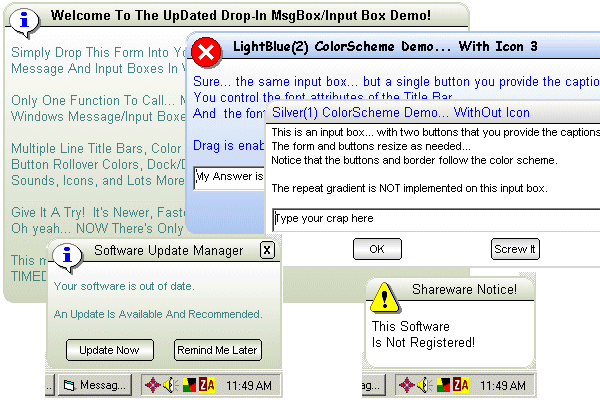



## A MAJOR REBUILD of my DropIn Input/MsgBox Replacement

### Description

This is a major (and I mean major) re-build of my previous drop in form replacement of the windows input box/message box without using MS ocx.

Now the drop-in form has only one control (text box) and only ONE function to call! But you can still choose several styles of boxes: Input box, Message Box, Nag screen, Timed message box (splash screen?) and Combine them as you like!

No graphics controls at all but has improved gradients, owner drawn buttons, dock/drag control, pick the display location, show all, some, or no buttons, and more!

It is very customizable... you control color schemes, gradients, fonts, font color and (bold/italic...etc).

----

12/02/05... Forgot to put the .frx for the msgbox in the zip (actually forgot the mouse pointer for the mouse over was stored there). So now zip has

the .frx file.

modified the readme.txt file
 
### More Info
 
Lots... see the code to customize the appearance and style of the boxes.

See the code and readme.txt file.

Function returns a string:

Input boxes return the text in the text box.

Msgboxes return (the button clicked in string form)

None if: NT3.1+ or Win95+ due to api used

             |
---                |---
**Submitted On**   |2005-12-01 16:43:22
**By**             |[CptnVic](https://github.com/Planet-Source-Code/PSCIndex/blob/master/ByAuthor/cptnvic.md)
**Level**          |Intermediate
**User Rating**    |5.0 (30 globes from 6 users)
**Compatibility**  |VB 4\.0 \(32\-bit\), VB 5\.0, VB 6\.0
**Category**       |[Custom Controls/ Forms/  Menus](https://github.com/Planet-Source-Code/PSCIndex/blob/master/ByCategory/custom-controls-forms-menus__1-4.md)
**World**          |[Visual Basic](https://github.com/Planet-Source-Code/PSCIndex/blob/master/ByWorld/visual-basic.md)
**Archive File**   |[A\_MAJOR\_RE1953061222005\.zip](https://github.com/Planet-Source-Code/cptnvic-a-major-rebuild-of-my-dropin-input-msgbox-replacement__1-63332/archive/master.zip)

### API Declarations

A few... see the zip

